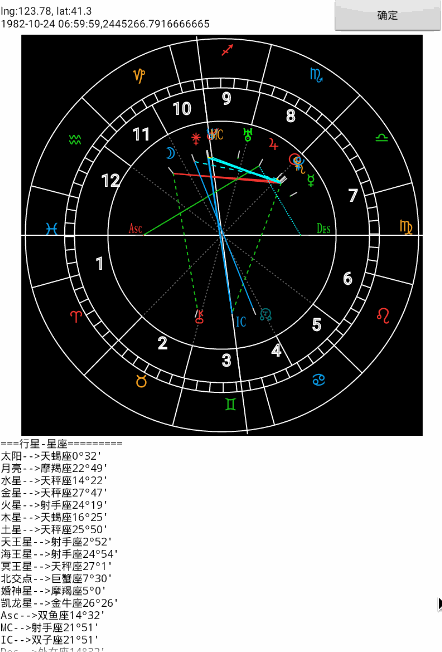

# 个人星盘-瑞士星历表(swisseph)

所有的个人星盘都是基于[瑞士星历表( Swiss Ephemeris)](http://www.astro.com/swisseph/swephinfo_e.htm)的算法来生成的，目前国内这方面的开源资料几乎没有。个人星盘就是一个人出生时，抬头仰望星空星体(太阳、月亮、金星、水星...)所在的位置，影响体有星体、星座、基本点(上升、下降、天顶和天底)以及宫位，具体概念及意义就不在描述。

这里的算法只介绍本命盘，也是作者查阅了大量的国外资料，不断摸索得到的结果。至于次限（长期大运)、三限（近期运势），只是条件不同，但是稍微注意一下细节即可。

;

决定本命盘的条件有2个，**出生时间**和出生地理位置的**经纬度**。

```java
int result = sw.swe_houses(time, flags, latitude, longitude, 'P', cusps, acsc);
```

条件决定了结果，星体与星体之间产生相位，天体在运动，地球自传，形成错综复杂的情况，从而反应出人的不同本性。国内还需要考虑时区、夏令时问题。


# 引用

- [swisseph-2.01-java](http://th-mack.de/download/index.html)
- 感谢[看星盘](http://www.kanxingpan.com/)的字体库


# 参考文档

- [星盘计算与手绘](http://tieba.baidu.com/p/2756471199)

- [swisseph-2.01.00 API Dokumentation](http://th-mack.de/download/swisseph-doc/index.html)

- [月亮次限推运法详解](http://blog.sina.com.cn/s/blog_4a5494eb01008c1s.html)

- [Swiss Ephemeris Test Page](http://www.astro.com/swisseph/swetest.htm)

- [本命盘调试](http://product.astro.sina.com.cn/swe)

  ​


# ABOUT ME

- [stackzhang.com](http://stackzhang.com)
- stackzhang@163.com

